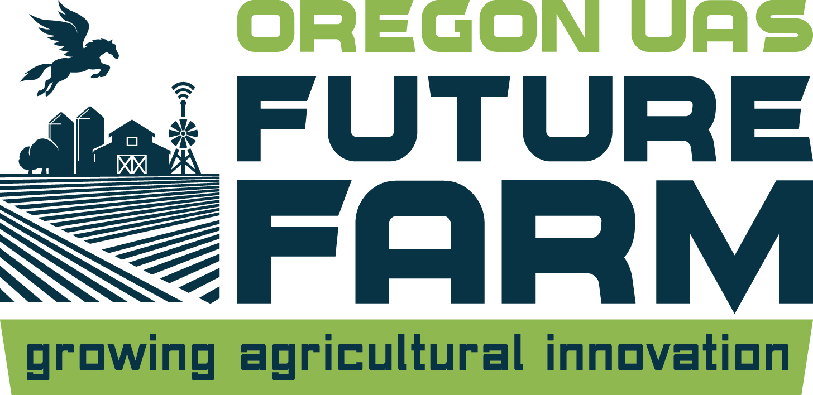
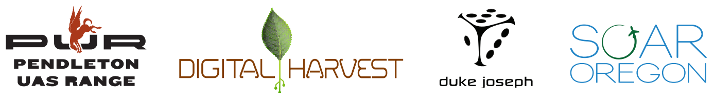

## About Future Farm

The FutureFarm features a 14,000 square miles FAA Certifed UAS Test Range, high value agricultural zones, new multi-layered remote sensing tools and a community of collaborative growers, researchers and digital agriculture experts who are ready to work with your team.

”The Oregon UAS FutureFarm is a ’real world’ proving ground designed to help Digital Agriculture Pioneers accelerate product development, cycles and market growth.”

## 2016 Drone Rodeo

#### Flight area basemap
For [drone rodeo](http://www.pendletondrone.rodeo/) attendees, see our [flight area basemap](https://api.mapbox.com/v4/mariospeedwagon.114mcnb5/page.html?access_token=pk.eyJ1IjoibWFyaW9zcGVlZHdhZ29uIiwiYSI6IjhiOTc1ZGU4YjQ1OWNiOWQwODkxZWYwOGU5YmRkODA4In0.wXM2jdidnk5hGXmVLDk6Zg#16/45.8069/-119.0863).

Users wishing to included it in a GCS basemap can use the public access token:
`pk.eyJ1IjoibWFyaW9zcGVlZHdhZ29uIiwiYSI6IjhiOTc1ZGU4YjQ1OWNiOWQwODkxZWYwOGU5YmRkODA4In0.wXM2jdidnk5hGXmVLDk6Zg`

*** 

## This `future_farm` repository

This repository is for sharing information between Future Farm colaborators. It contains boundaries, ground sensor locations and histories. Hefty data archives may be stored on other services, but access to all resources should be documented here.

### Dev Notes

* August 2nd added up to date soil moisture data as `csv` files.
* Next soil moisture upload planned for August 17th.
* Satellite imagery upload planned for August 5th.

*** 

